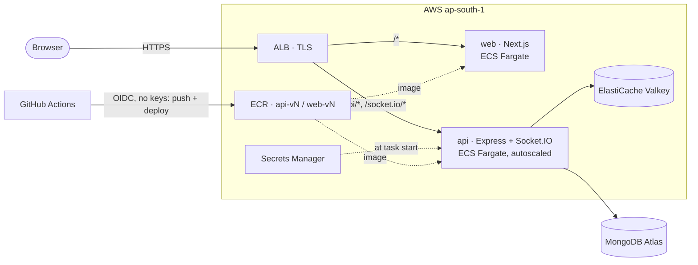

# Smart JobHub

A job platform for Bangladesh: candidates find and apply for jobs, employers post roles and run their
company page, and both sides chat in real time. It runs on AWS with Terraform-managed infrastructure,
keyless CI/CD and versioned, gated releases.

[](https://github.com/Hazrat16/smart-jobhub/actions/workflows/api.yml)
[](https://github.com/Hazrat16/smart-jobhub/actions/workflows/web.yml)
[](https://github.com/Hazrat16/smart-jobhub/actions/workflows/infra.yml)
[](https://github.com/Hazrat16/smart-jobhub/actions/workflows/codeql.yml)

## Live demo

**https://&lt;your-domain&gt;**

| Role | Email | Password |
|---|---|---|
| Jobseeker | `demo.jobseeker@smartjobhub.test` | `<DEMO_PASSWORD>` |
| Employer | `demo.employer@smartjobhub.test` | `<DEMO_PASSWORD>` |

The demo accounts are shared, and everything they change is reset every night at 03:00 (Dhaka).
Job boosting is a live SSLCommerz checkout on this site, so look, but don't pay.

## What it does

- **Jobs:** search and filter; post, edit and close roles; featured ("boosted") listings sorted first.
- **Applications:** apply with a resume; employers move applicants through a status pipeline with history.
- **Companies:** a company profile with several employer members, and public company pages.
- **Real-time chat** between candidates and employers (Socket.IO), with typing, read receipts and presence.
- **Payments:** employers pay through SSLCommerz to boost a job; prices are computed on the server.
- **AI resume and job-fit analysis** through any OpenAI-compatible API (Groq by default).
- **Auth:** JWT, email verification, password reset, role-based access (jobseeker, employer, admin).

**Stack:** Next.js 15 + React 19 · Express 5 + TypeScript · MongoDB (Atlas) · Valkey/Redis (Socket.IO
adapter, rate limits, BullMQ) · AWS ECS Fargate · Terraform · GitHub Actions.

## Architecture



The browser only ever talks to one origin, so the same image runs in staging and production. More in
[docs/architecture.md](docs/architecture.md).

## Production readiness

| Area | What's in place |
|---|---|
| **CI on every PR** | `npm audit`, lint, typecheck, integration tests against real MongoDB and Redis, Playwright smoke test, Docker build + Trivy scan, CodeQL; Terraform fmt / validate / tflint / checkov / `terraform test`, plus a plan for each environment. |
| **Releases** | Manual and versioned (`api-v12`). Built once, pushed to IMMUTABLE ECR tags, and promoted to prod only after passing staging, behind an approval. The smoke test confirms the new version is serving. [Releasing](docs/releasing.md) |
| **Safe deploys** | ECS circuit breaker with automatic rollback. The pipeline watches the new deployment's rollout state, so a rollback fails the run. Rolling back = promoting the previous version. |
| **Security** | GitHub OIDC only, no AWS keys. One role per workflow file, scoped to its own app. A permissions boundary on everything CI creates. Secrets only in Secrets Manager. Tasks reachable only from the ALB. TLS to Valkey and Atlas. |
| **Infrastructure as code** | Terraform with remote state and native locking. One environment module, used by staging and prod. Staging applies on merge; prod applies the exact saved plan that was approved. Tests run against a mocked AWS provider. |
| **Scaling** | CPU target tracking (api 1–3, web 1–2 tasks); the Redis adapter delivers chat across tasks. |
| **Observability** | CloudWatch alarms (5xx, p95 latency, no healthy targets, CPU and memory, Valkey memory, failed deployments) → email. Sentry tagged with environment and release. Structured JSON logs. |
| **Operations** | A [runbook](docs/runbook.md) section for every alarm, a monthly AWS budget alert, and a quarterly [database restore drill](docs/restore-drill.md). |
| **Decisions** | [Architecture decision records](docs/decisions/README.md): why Fargate, why no NAT, why manual releases, why RabbitMQ was removed, … |

Runs for about $50/month (staging) + $65/month (prod) + Atlas.

## Repository

```
apps/api     Express 5 + Socket.IO + BullMQ backend        → apps/api/README.md
apps/web     Next.js 15 frontend                           → apps/web/README.md
infra/       Terraform: bootstrap, modules, envs/{staging,prod}
docs/        architecture, releasing, runbook, restore drill, ADRs
.github/     CI, deploy workflows, deploy action and scripts
```

## Run it locally

```bash
# API + MongoDB + Redis, hot reload, on :5000
cd apps/api && docker compose -f docker-compose.dev.yml up --build

# Web on :3000 (proxies /api to :5000 in dev)
cd apps/web && npm ci && npm run dev

# Demo accounts and sample jobs
cd apps/api && MONGODB_URI=mongodb://127.0.0.1:27017/job-platform \
  DEMO_PASSWORD=choose-something SEED_DEMO_CONFIRM=yes npm run seed:demo
```

Tests: `cd apps/api && docker run -d -p 27099:27017 mongo:7.0 && npm test`.

## Setting up AWS from scratch

1. [infra/BOOTSTRAP.md](infra/BOOTSTRAP.md): state bucket, OIDC, ECR, CI roles, budget (one-time, by hand).
2. [infra/envs/staging/README.md](infra/envs/staging/README.md) and [infra/envs/prod/README.md](infra/envs/prod/README.md).
3. [infra/DATA.md](infra/DATA.md): Atlas and secrets.
4. [docs/releasing.md](docs/releasing.md): first releases.
