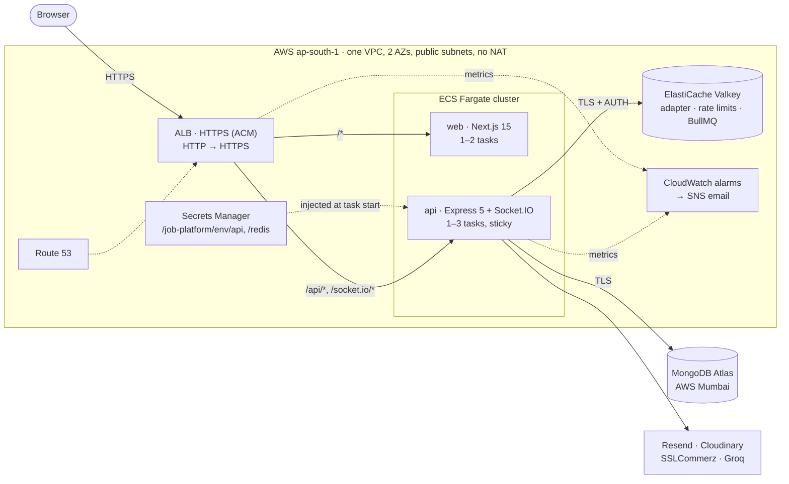
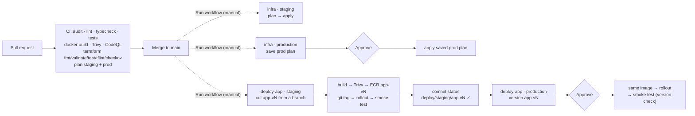

# Architecture

## Runtime (one environment)



- **Same origin.** The browser only talks to one host. `/api` and `/socket.io` go to the api, everything
  else to web, so the web image has no environment config baked in ([ADR 3](decisions/0003-same-origin-build-once-promote.md)).
- **Real-time chat across tasks.** Socket.IO's Redis adapter delivers an event on whichever api task the
  receiver is connected to; the ALB's sticky sessions keep long-polling on one task ([ADR 8](decisions/0008-remove-rabbitmq.md)).
- **Network.** Tasks have public IPs for outbound traffic, but only the ALB may reach them, and only the
  api may reach Valkey ([ADR 4](decisions/0004-public-subnets-no-nat.md)).
- **Secrets.** ECS reads them from Secrets Manager when a task starts. CI never sees them.

## Delivery



- **Credentials.** CI authenticates to AWS with GitHub OIDC only. Each role trusts one workflow file on
  `main` ([ADR 5](decisions/0005-github-oidc-least-privilege.md)).
- **Releases.** Versions are manual, immutable, and must pass staging before prod
  ([ADR 6](decisions/0006-manual-versioned-releases.md), `docs/releasing.md`).
- **Terraform.** Nothing applies on merge. Each environment is applied by a manual run, and prod
  applies the exact plan that was approved
  ([ADR 7](decisions/0007-terraform-state-and-apply-flow.md)).

## Infrastructure code

```
infra/
  bootstrap/        one-time, applied by hand: state bucket, OIDC provider, ECR, CI roles, boundary, budget
  modules/
    environment/    one environment = everything below, wired together
    network/  alb/  ecs-service/  redis/  secrets/  monitoring/  ecr/  github-oidc/
  envs/staging/     values only (Spot, fixed size, 14-day logs)
  envs/prod/        values only (on-demand, autoscaling, deletion protection, demo reset)
```

Every module with logic has `terraform test` suites against a mocked AWS provider, run in CI.
